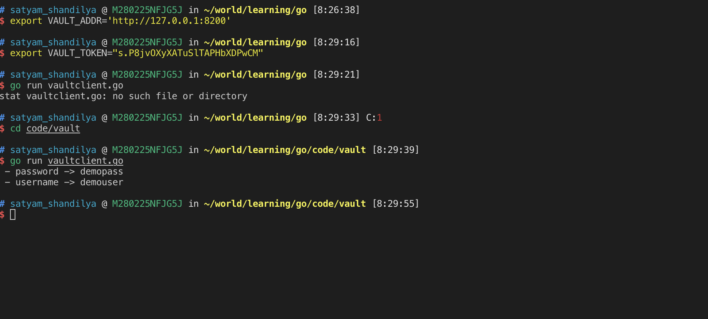

## Vault-Clients
This repository provides simple clients to interact with Hashicorp Vault. The intention is to be able to connect to a configured vault and read secrets from it.

## Vault configuration

- Please refer to the [installation guide](https://www.vaultproject.io/docs/install/) for installation of vault.

- Once vault is installed, let us start **Dev server** using `vault server -dev` command. This is sufficient for our sample. You can refer to the [documentation](https://learn.hashicorp.com/vault/getting-started/dev-server) for more details.

- Starting the server provides us with two important information
    - Uri to connect to the vault.
    - Token to be used for authentication.

    

- We can create our [first secret](https://learn.hashicorp.com/vault/getting-started/first-secret) in KV [secret engine](https://learn.hashicorp.com/vault/getting-started/secrets-engines)

    - Before writing secret, we need to export token and URI as environment variable.

        ```bash
        export VAULT_ADDR='http://127.0.0.1:8200'
        export VAULT_TOKEN="<<TOKEN>>"
        ```

    - Now, create the secret using `vault kv put secret/hello foo=bar`. You can add multiple key-value pairs i.e. `vault kv put secret/hello foo=bar hello-world`.

    - To retrieve the secret that was saved, you can use `vault kv get secret/hello`

    - You can also get the secrets using REST API provided by vault.
        ```sh
        curl \
        --header "X-Vault-Token: s.P8jvOXyXATuSlTAPHbXDPwCM" \
        --request GET \
        http://127.0.0.1:8200/v1/secret/data/hello
        ```

        - In the url, there is */data* between secret and hello. It is intentional. In default KV engine, secrets are strored this way. 

        - In the response of curl command, secrets are again wrapped inside *data* object.

        
    
- Ideally, we would like keep our secrets in simple objects and not wrapped inside *data* object as we saw above. Let us make use of secrets engine for this.

    - First, let us disable **secrets** using `vault secrets disable secret`

    - Enable another instance of kv secrets engine at secret using `vault secrets enable -version=1 -path=secret kv`

    - Now you can write your secret using `vault write secret/vaultdemo username=demouser password=demopass`

    - This data can be retrieved using `vault kv get secret/vaultdemo`
    
      

    - You can notice the difference in the response.

    - Please refer https://learn.hashicorp.com/vault/getting-started/secrets-engines for details on secrets-engine.

- You can use this setup with all the clients created in the repository.

    - Java client using [Spring boot and spring-cloud-vault](https://cloud.spring.io/spring-cloud-vault/)
    

    - Node client using [node-vault](https://github.com/kr1sp1n/node-vault)
    

    - Python client using [hvac](https://github.com/hvac/hvac)
    

    - Go client using hashicorp managed [Vault Go Client](https://github.com/hashicorp/vault/tree/master/api)
    

        - This would need you to execute `go get github.com/hashicorp/vault/api`
